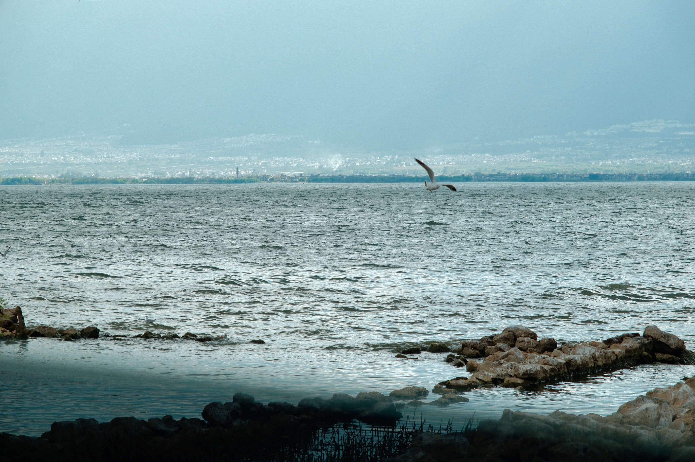

3月底、4月初去云南玩了一趟。回来之后，生活一下子发生了挺大的变化。

半年没上班的我，也重新开始上班了；同时，也开始谈恋爱了。生活好像突然被填得很满，忙着适应，忙着经历，也就没什么时间再去记录这些日子了。

这段时间里，OpenClaw 被我舍弃了，NAS 也冷落了，Docker、青龙脚本这些东西也只是断断续续地在维护。

不知道是不是因为生活变充实了，折腾这些东西的乐趣也没有以前那么强了。以前总觉得捣鼓这些很有意思，现在却常常提不起太多劲来。

看来人还是不能太闲。

太闲的时候总想折腾，真忙起来以后，反而会慢慢回到生活本身。

不过后面的日子，应该也会慢慢继续折腾起来吧。

让生活再多一点折腾，也多一点精彩。

附一张洱海的照片吧。
